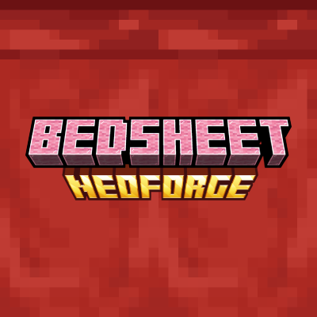

# BedSheet

Sheet is unofficial Carpet Mod [NeoForge](https://neoforged.net/) port, for Minecraft 1.21.x and above.  

Carpet Mod is a mod for Minecraft that allows you to take full control of what matters from a technical perspective of the game.

* Test your farms over several hours in only a few minutes using `/tick warp`, as fast as your computer can
* ...and then see a detailed breakdown of the items they produce using `hopperCounters`
* See the server mobcap, TPS, etc. update live with `/log`
* Let pistons push block entities (ie. chests) with `movableBlockEntities`

## Settings
Same Carpet Mod. 
See [Carpet Mod wiki: List of all currently available settings](https://github.com/gnembon/fabric-carpet/wiki/Current-Available-Settings).

## Credits
- [`gnembon/fabric-carpet`](https://github.com/gnembon/fabric-carpet)

**DON'T feedback ANY issues about BedSheet in fabric-carpet repository!**
